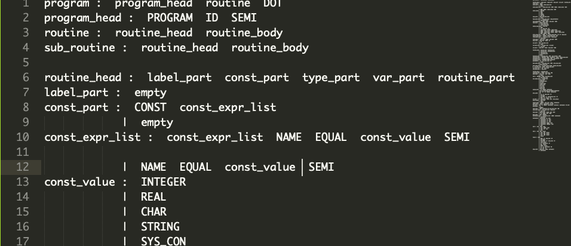
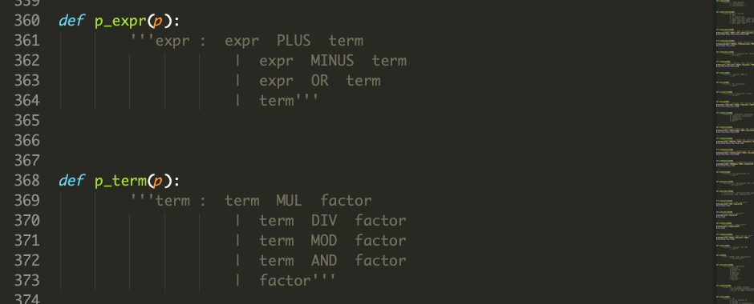

# cpp: Compiler for Pascal by Python

首先我实现了下lex和yacc，要求是按照SPL的doc来的，而不是按照SPL的要求来的

### handle_req.py 将文档中的产生式要求自动转化为python函数

首先手工地将word文档中要求的产生式整理好，文件是`requirement`

然后通过代码`handle_req.py`，提取产生式左端的非终结符名称作为函数名称的组成部分，然后将后面的单条或多条表达式在函数中说明。得到如下图，

然后为了能够构建分析树，将一条产生式读入，分割，根据其是否全是小写且不是`:`获取其中的，需要参与分析树构建的终结符或者非终结符。如图

然后将其中的非终结符拿出，写成如下的形式

最后，考虑到如果多个产生式合并在一起，其判断条件比较难以编程，所以使用`if`语句留好位子，如下

这样，我们就完全使用代码，生成了所有PLY需要的产生式

### Reminder

 在keyword里面有not，在运算符里面也有NOT，但是这两个应该是不同的

##### 找到了一种可视化的方法

这是在网上找到的一段将树结构可视化的代码，通过在规约的过程中顺带将child添加到parent中可以得到树结构，将这个结构可视化即可得到如下图所示的树

### Problems

有的合并产生式没有找到很好的处理方法，但是仅仅对于绘制分析树而言，这应该是不必要的。Help needed

两个not的问题

int实现了但是real还没有