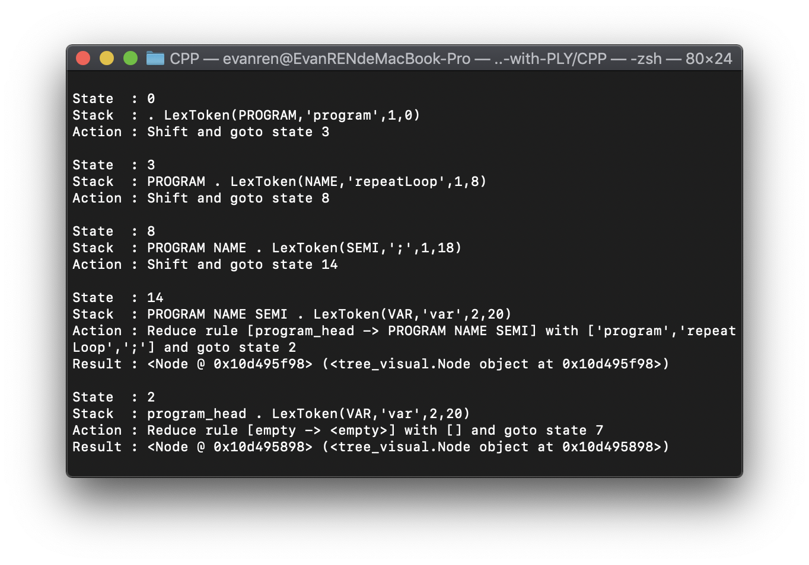
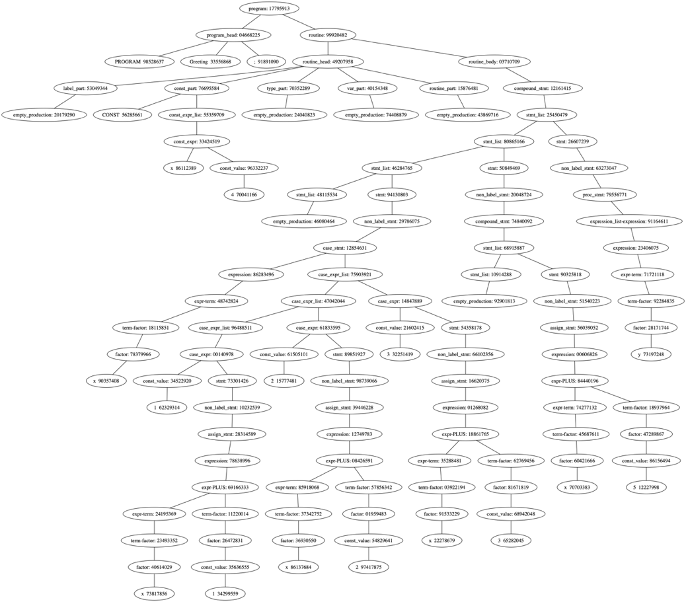
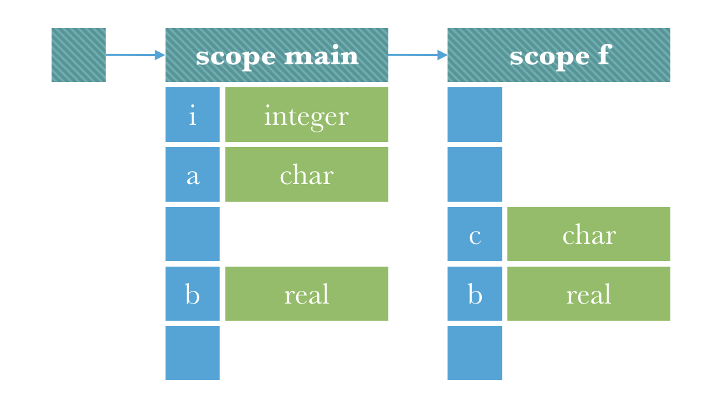
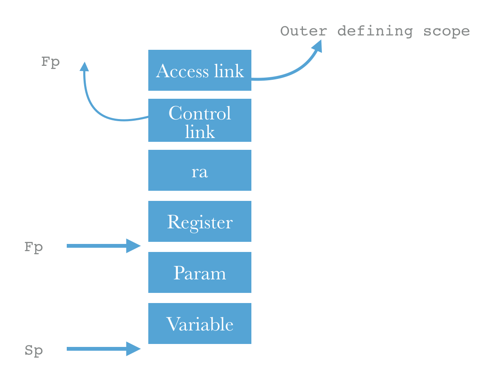

# Report 编译原理项目报告

# CPP: Compile for Pascal by Python 

| 邱兆林     | 刘洪甫 | 任宇凡     |
| ---------- | ------ | ---------- |
| 3160105287 |        | 3160104704 |

[TOC]


## 总体架构


如上图所示，在CPP(Compiler for Pascal in Python)中，我们实现了从pascal代码到最终可执行的MIPS代码之间的编译过程。最终获得的MIPS代码可以在Mips模拟器上直接运行并且获得Pascal代码想要的结果。

在处理的过程中首先是通过词法和语法分析，从pascal代码构建抽象语法树，在这个过程中也完成了符号表的构建和中间代码的生成。在中间代码的生成过程中进行了类型检查。当完成了中间代码的生成和符号表的构建之后开始目标代码的生成。

和一般使用的通过LLVM的方式实现中间代码的生成到目标代码的生成的方法不同，在我们的工程中我们自己实现了中间代码的生成到目标代码的生成工作。这也就意味着我们需要自己维护运行时环境，这包括了跳转到函数过程中访问链和控制链的维护，也包括了栈内存的分配，返回地址的保护，也包括从函数返回过程中，恢复现场(恢复寄存器)，和保存返回值的工作。

最终我们将生成的MIPS代码放在MIPS模拟器上直接运行，然后得到了正确的结果。

在本报告的倒数第二个章节，我们对老师提供的测试样例，以及我们自己编写的一些测试样例进行了测试，均得到了正确的结果。我们还会对这样的结果进行分析。在最后一个章节我们会对我们的编译器提出可能的优化与展望。

## 词法分析

词法分析部分部分的主要功能是将输入分析的pascal文本处理成一个一个的token。这是编译器处理的第一个环节，通过词法分析后续过程就不需要再面对原始文本，而是一个一个有名字，有类型的token，这位后续的分析提供了很大的便利性。

举个例子，对于普通的变量名NAME，我们可以如下地通过ply.lex库对其通过正则表达式进行定义，这个正则表达式描述了一个以字母开头，后面有字母也可能有数字的一个token，这也就是NAME。


下面这个例子是实数的，实数的重要组成是中间的小数点，前面的d表示的是数字。


### 优先级问题

关于优先级问题ply.lex的处理方法和LEX的方法是类似的，都是通过定义的顺序来决定优先级，并且在实际匹配中采用最长匹配原则。

### ply.lex

ply.lex是一个完全通过Python实现的词法分析库，可以通过Python语言，像C语言使用LEX一样使用词法分析功能。


### lex测试

```pascal
program test3; 
var 
    A : integer; 

    procedure ScopeInner; 
    var A : integer; 
        begin
        A := 10; 
……
```

上面是一段pascal代码，这是不完整的，但是可以用于说明。

```
LexToken(PROGRAM,'program',1,0)
LexToken(NAME,'test3',1,8)
LexToken(SEMI,';',1,13)
LexToken(VAR,'var',2,16)
LexToken(NAME,'A',3,22)
LexToken(COLON,':',3,24)
LexToken(SYS_TYPE,'integer',3,26)
LexToken(SEMI,';',3,33)
LexToken(PROCEDURE,'procedure',5,38)
LexToken(NAME,'ScopeInner',5,48)
LexToken(SEMI,';',5,58)
LexToken(VAR,'var',6,62)
LexToken(NAME,'A',6,66)
LexToken(COLON,’:’,6,68)
```

上面这些Token就是从上面的pascal代码生成的。

## 语法分析

语法分析过程主要有自顶向下和自底向上两种类型。自顶向下方法以LL(1)分析为代表；自底向上分析方法以LR(1)，SLR(1), LALR(1)分析为代表。其中，既有足够强大的表达能力，又足够简单的是LALR(1)分析。在LALR(1)分析中向前展望一个符号。而由于有了YACC语法分析工具这样的部件可以使用，编程者不再需要自己去处理语法分析，而是传入文法的产生式，然后自动生成语法分析的结果：抽象语法树。

这部分的代码在`CPP_yacc.py`中，

如下例中，我们希望写出从routine头，主标签，以及routine内容到routine的规约。于是我们的书写过程如下所示。这个里面值得关注的一点是和一般的Python代码逻辑不通，这里中间的注释内容才是需要的。(Python中三个连续的引号是注释)


在下面一个例子中我们希望写出程序头的产生式。而这一个产生式也是在下面介绍ply.yacc的过程中使用到的例子。


### ply.yacc

ply.yacc方法是对于Python支持的语法分析库，通过ply.yacc我们可以通过Python语言像C语言使用YACC工具一样简单地使用语法分析功能。

而ply.yacc比较出色的一点在于其更加强大的debug能力。

首先ply.yacc可以生成文法的所有的产生式，如下图所示(这一步基本上是对于我们提供的产生式的优化)


第二是通过开启debug模式我们可以在处理的过程中看到语法分析的全过程。这包括在处理的过程中栈是怎么变化的，采用了什么样的规约，或者移进操作。



在上图中我们可以看到语法分析在处理一个pascal程序最开始的时候。首先遇到了PROGRAM这个保留字（注意其中的点号，这个点号和我们在编译原理课程中学到的分割输入和栈的点号意义完全相同），然后采取了移进操作。然后获取到了一个名为`repeatLoop`的名字，这个名字显然就是函数名了。然后接着又得到了一个分号，得到分号之后通过规约操作`[program_head -> PROGRAM NAME SEMI] with ['program','repeatLoop',';']`将刚刚收到的所有内容规约成一个`program_head`。这样就完成了函数头部的处理，往往一个稍微长的pascal代码的处理过程，操作数目非常巨大，但是不可否认这样的直观的栈和输入流，可以给代码的编写带来便利。

### yacc测试

```
A := 20000; 
```

上面是一条pascal的语句，其中完成了对A变量的赋值操作。而下面是当栈顶是赋值符号，然后输入一个20000的语法分析过程。可以看出这个20000在词法分析的过程中已经被处理成了一个整数Integer。然后程序采用的是移进，将integer读入到栈顶，然后展望到分号。

当看到分号之后程序采用了将integer规约成const_value的规约操作，然后将这个const_value进一步变成factor。这和我们的预想是完全一样的。

```
State  : 61
Stack  : program_head routine_head BEGIN stmt_list NAME ASSIGN . LexToken(INTEGER,20000,23,287)
Action : Shift and goto state 77

State  : 77
Stack  : program_head routine_head BEGIN stmt_list NAME ASSIGN INTEGER . LexToken(SEMI,';',23,292)
Action : Reduce rule [const_value -> INTEGER] with [20000] and goto state 76
Result : <Node @ 0x10a5a8a20> (<tree_visual.Node object at 0x10a5a8a20>)

State  : 76
Stack  : program_head routine_head BEGIN stmt_list NAME ASSIGN const_value . LexToken(SEMI,';',23,292)
Action : Reduce rule [factor -> const_value] with [<Node @ 0x10a5a8a20>] and goto state 71
Result : <Node @ 0x10a5d3b38> (<tree_visual.Node object at 0x10a5d3b38>)

State  : 71
Stack  : program_head routine_head BEGIN stmt_list NAME ASSIGN factor . LexToken(SEMI,';',23,292)
Action : Reduce rule [term -> factor] with [<Node @ 0x10a5d3b38>] and goto state 69
Result : <Node @ 0x10a5d3b00> (<tree_visual.Node object at 0x10a5d3b00>)
```

## 抽象语法树的生成

抽象语法树的生成过程应该是在语法分析的过程中完成的，而在我们的代码实现中确实也是这样的。

由于在语法分析的过程中我们可以对产生式定义相应的动作，所以在这个过程中我们也完成了将抽象语法树的儿子节点添加到父节点的工作。这个过程中我们需要使用到节点的定义。和节点的函数。这部分的代码在`tree_visual.py`中。

#### Node定义

```python
class Node(object):
    def __init__(self, t, c):
        self.type = t
        self.children = c
        self.id = "%s: %08d" % (
            self.type, round(random.random() * 100000000))
```

Node定义中有三个成员

- type：表示类型，Node的类型有很多中种，一般是直接采用产生式的左端，比如说`if_stmt`这样的。这个type将会作为名字的一部分绘制到结点中。
- Children：一个存放儿子节点的列表。在children中放置各种不同的儿子节点。
- id：id中存放的是type加上一个随机数。这样做的目的是为了克服在绘制抽象语法树的过程中由于名字重复而绘制混乱的问题。

例如在下面的代码中我们将一句if语句的儿子全部添加到父亲节点中

```python
def p_if_stmt_with_else(p):
    '''if_stmt :  IF  expression  THEN  if_label1  stmt  if_label2  ELSE  stmt  if_label3'''
    #     0       1       2        3        4       5       6        7     8        9
    p[0] = Node("if_stmt", [p[2], p[5], p[8]])
```

又比如下面的一行对`goto`语句的产生式，我们将跳转到的行号写在父亲结点里面

```python
def p_goto_stmt(p):
    '''goto_stmt :  GOTO  INTEGER'''
    p[0] = Node("goto_stmt", [p[2]])
```

在具体的绘制过程中我们需要对抽象语法树进行一次变量，然后将每一条边添加到我们即将绘制的图片中，最后将图片输出。

### pydot库

pydot是一个Python的绘图库，通过这个库我们可以比较方便地完成抽象语法树的绘制工作。


### 测试抽象语法树的绘制

比如说对于`cases.pas`的例子，它的代码如下

```pascal
PROGRAM Greeting;

CONST
x = 4;

var y : integer;
   
BEGIN

   CASE x OF
    1: y := x + 1;
    2: y := x + 2;
    3: y := x + 3;
    END;
    BEGIN
        y := x + 5;
    END;

   WRITELN(y);
END.
```

绘制出来的抽象语法树如图所示




当我们关注其中的case语句的时候，可以将图片放大

```pascal
   CASE x OF
    1: y := x + 1;
    2: y := x + 2;
    3: y := x + 3;
    END;
```

其对应的部分是，


可以看出最左边的是case语句的`x`，而后面的每一条分支，其中的第一个分支是1，2，3，这分别是`case`中的几种选择情况。而后面具体的表达式应该是`x+1`等。这符合了我们的预期。

## 语义分析(这个如果没有的话就写一下类型检查吧)


## 符号表

符号表在生成抽象语法树的过程中建立。符号表的总体结构如下图所示。



### 符号类

符号类是用来存放一个符号的。所有的符号都是符号类的一个对象。它的结构按照下表定义。

| 属性         | 含义                         | 说明                                                         |
| ------------ | ---------------------------- | ------------------------------------------------------------ |
| name         | 符号名                       | 转化为小写                                                   |
| type         | 符号类型                     | 可以是基础类型 'integer', 'real', 'char', 'boolean'，复杂类型 'array', 'record'，或者是已定义的其他类型。 |
| var_function | 用于区分该符号是变量还是函数 | 'var', 'const', 'function', 'procedure', 'type'              |
| offset       | 偏移量                       | 指该符号在其作用域内的偏移量                                 |
| params       | 参数                         | 复杂类型或函数时用于保存额外信息                             |
| size         | 大小                         | 初始化时自动计算                                             |
| reference    | 是否为引用                   |                                                              |

其中，params 只当 const、function、procedure、array、record 时有参数。如果是 function，那么 params 依照一下的 list 传递参数列表：

```
[
    (arg1, type1),
    (arg2, type2),
    ...
]
```
如果是 array，那么 params 依照以下的 dict 传递数据类型和范围：
```
{
    'data_type': 'integer',
    'dimension': [(0, 100), (0, 1000), ...]
}
```
如果是 record 那么 params 依照以下的 list 传递结构：（其中 type 可能是复杂类型）
```
[
    (name1, type1),
    (name2, type2),
    ...
]
```
如果是 const 那么 params 传递常量的值。

### 作用域类

本编译器的符号表按照不同的作用域分别保存。每一个作用域用一个作用域类的对象来记录。

| 属性      | 含义                         | 说明                                                         |
| --------- | ---------------------------- | ------------------------------------------------------------ |
| name      | 作用域名                     | 转化为小写，用 '.' 连接父作用域名，例如 'main.f'             |
| width     | 宽度                         | 可以是基础类型 'integer', 'real', 'char', 'boolean'，复杂类型 'array', 'record'，或者是已定义的其他类型。 |
| symbols   | 符号 | 'var', 'const', 'function', 'procedure', 'type'              |
| temps | 偏移量                       | 指该符号在其作用域内的偏移量                                 |
| labels | 参数                         | 复杂类型或函数时用于保存额外信息                             |

当定义一个新符号时，首先初始化一个符号类，并且把当前作用域宽度传递给符号类的构造函数，这样符号类中就可以保存正确的偏移量信息。接着，把它添加到 symbols 或者 temps 中，最后更新作用域类的 width。

当定义一个 label 时，生成一个字符串，并且把它添加到 labels 集合中。

### 符号表类

符号表类是符号表的接口类，提供接口给编译器的其他部分使用。符号表类使用栈来保存作用域。当有新的一层作用域时，将其入栈。当作用域结束时，将其出栈。符号表内定义了以下方法。

| 方法                       | 含义                               |
| -------------------------- | ---------------------------------- |
| scope()                    | 获取当前作用域                     |
| get_identifier(name)       | 从符号表中查找一个符号             |
| get_identifier_scope(name) | 从符号表中查找一个符号所处的作用域 |
| define(name, type, ...)    | 在当前作用域定义一个符号           |
| get_temp(type, ...)        | 在当前作用域获取一个临时符号       |
| get_label()                | 在当前作用域获取一个 label         |
| add_scope(name, type)      | 增加一层作用域                     |
| del_scope()                | 删除一层作用域                     |

### 符号表使用样例

引入符号表模块后，使用上面定义的结构对符号表进行操作。运行以下的测试样例：

```python
t = Table()
t.define('IDCard', 'record', 'type', [
    ('ID', 'integer'),
    ('name', 'char')
])
t.add_scope('f', 'function', 'integer')
t.define('Student', 'record', 'type', [
    ('name', 'char'),
    ('card', 'IDCard')
])
t.define('CircleLin', 'Student', 'var')
t.define('students', 'array', 'var', {
    'data_type': 'Student',
    'dimension': [(1, 100)]
})
print(t)
```

会得到下面的符号表：

```python
Table([
    Scope(`main`, symbols=[
        Symbol(`idcard`, record, type, 0, [
            ('ID', 'integer'), 
            ('name', 'char')
        ])
    ], temps=[]),
    Scope(`main.f`, symbols=[
        Symbol(`student`, record, type, 0, [
            ('name', 'char'),
            ('card', 'IDCard')
        ]),
        Symbol(`circlelin`, student, var, 0),
        Symbol(`students`, array, var, 12, {
            'data_type': 'Student', 
            'dimension': [(1, 100)]
        })
    ], temps=[])
])
```

## 中间代码生成


## 代码生成



> 从中间代码到目标代码的生成过程，虽然可以使用LLVM框架等简单办法，但是考虑之后我们还是选择了自己手动地编写从中间代码到目标代码的转换，其中包括复杂的运行时环境的维护。

### 堆栈管理与函数跳转

代码生成中比较复杂的是运行环境的维护，并且需要管理寄存器和程序运行的堆栈。

由于我们的spl程序运行环境是基于栈的动态环境，所以在进入函数时需要(1)分配足够的栈空间给局部变量；(2)更新返回地址；(3)更新控制链和访问链；(4)保存寄存器的状态以便在退出函数时恢复；(5)将函数调用的参数进行压栈处理，以便在函数中使用。接下来我们将会跟着代码，详细地介绍其中的每一个环节。

#### 访问链的处理

访问链的处理较为复杂，需要分情况讨论。因为访问链不总是指向该函数的调用者，这个关系应该是在定义时就确定的。举个例子，

```pascal
procedure hello(x: real);

    var y: integer;
    procedure hello_2(xx: real);
        var yy: integer;
        begin
        g();
        end;
        
    begin
    writeln(x+y);
    end;
```

在上面代码段中，`hello_2`这段例程中就可以访问外部的`hello`例程中的变量，比如`y`。但是在`hello_2`中调用函数`g()`。函数`g()`中就不可以访问到`hello_2`的变量，更不能访问到`hello`中的变量。

于是我们想到了一种区分两种情况的办法，因为我们通过定义(也就是scope)可以确定`hello_2`例程的访问链总是指向`hello`的。所以当`hello_2`的调用者不是`hello`时我们将访问链指向其调用者的访问链所指。当其调用者就是`hello`时，访问链直接指向其调用者。

简要地说，一个新创建的函数的栈中的访问链，应该

- 指向其调用者，如果其调用者就是在定义时嵌套该函数的。或者，
- 和其调用者有相同的访问链指向。

在代码实现如下

```python
        if codeline[4] == '.'.join(self.scopeStack[-1].split('.')[:-1]):
            # 访问控制 = 当前活动访问控制
            self.asmcode.append("# = parent's")
            self.asmcode.append('lw $t8, 76($fp)')
            self.asmcode.append('sw $t8, 0($sp)')
        else:
            self.asmcode.append('# = fp')
            self.asmcode.append('sw $fp, 0($sp)')
```

上面第一种情况下，将其parent的访问链直接复制到了当前的，而第二种情况下将访问链指向了其parent的栈底。

#### 控制链的处理

相比起访问链的处理，控制链的处理简单了许多。只需要将其parent的fp放到合适的位置即可。

```python
self.asmcode.append('sw $fp, -4($sp)')
```

#### 返回地址存放

```python
self.asmcode.append('sw $ra, -8($sp)')
```

#### 寄存器状态的保存

```python
for index in range(8, 24):
# SW R1, 0(R2)
	self.asmcode.append("sw $%s, %d($sp)" % (index, -12 - (index-8)*4))
```

#### 变量的空间分配

这一步通过把栈指针往下移动的方式给当前函数分配栈空间。

其中首先通过`symtable`符号表获取当前函数中所有的函数需要占用的空间，然后将栈指针往下移动。其中的76是固定的需要移动的长度，包括访问链，放回地址等需要的空间。

```python
self.asmcode.append('addi $fp $sp -76')
scope_width = self.symtable['%s.%s' %
(codeline[4], codeline[3].lower())].width
self.asmcode.append('addi $sp $sp %d' % -(scope_width + 76))
```

#### 完成跳转

```python
self.asmcode.append("jal %s" % codeline[3])
```

通过jal指令跳转到合适的label所在位置。

#### 将返回值从$v0中取出

当完成跳转之后，将在函数中计算出的参数保存下来，存放到当前寄存器分配得到的寄存器中。

```python
# 将返回值从 $v0 中取出
if codeline[2]:
block_index = self.allocReg.line_block(codeline[0])
reg_lhs = self.handle_term(codeline[2], block_index, codeline[0])

self.asmcode.append("move, {}, $v0".format(reg_lhs))
```

### 参数传递

函数调用过程中的参数传递需要考虑到参数的个数超过默认可用的寄存器`a0,a1,a3`，这种时候我们就需要将参数压入栈中，并且告知被调函数参数存放的位置。这个告知的过程是通过寄存器分配完成的。

```python
line_num, _, _, op1, _ = codeline
block_index = self.allocReg.line_block(line_num)
reg_op1 = self.handle_term(op1, block_index, line_num)

const_type = [int, str, bool]
if type(op1) in const_type:
  self.asmcode.append('li $t8, %d' % reg_op1)
  self.asmcode.append('sw $t8, -%d($sp)' % (76 + self.paraCounter*4))
else:
  self.asmcode.append('sw %s, -%d($sp)' %
  (reg_op1, 76 + self.paraCounter*4))
```

在上面的代码中，由于我们在中间代码的时候已经将参数传递的每一个参数都转化为了一行中间代码。所以这里我们只需要压入一个参数。而不需要将所有的参数都压入。

### 引用传递


```python
line_num, _, _, op1, _ = codeline
block_index = self.allocReg.line_block(line_num)
reg_op1 = self.handle_term(op1, block_index, line_num)

if op1.reference:
  self.asmcode.append(
  '\n# pass value because it is an address already. ')

  self.asmcode.append('lw $t9, {}($fp)'.format(-op1.offset))
  self.asmcode.append('sw $t9, -%d($sp)' %
  (76 + self.paraCounter * 4))
else:
  self.asmcode.append(
  '\n# pass address.')
  self.asmcode.append("addi $t8, $fp, %d" % (-op1.offset))
  self.asmcode.append('sw $t8, -%d($sp)' %
  (76 + self.paraCounter * 4))

self.paraCounter += 1
```


### 寄存器分配


## 测试样例


## 优化与展望


## 附1： 分工


## 附2：测试样例与工程代码